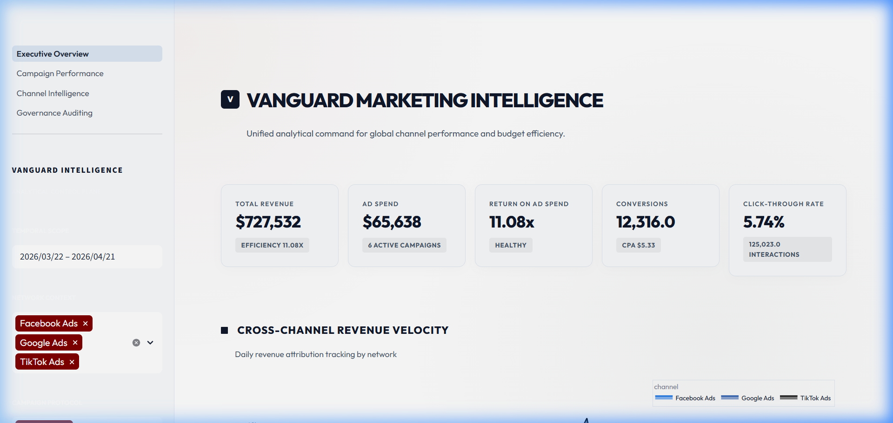
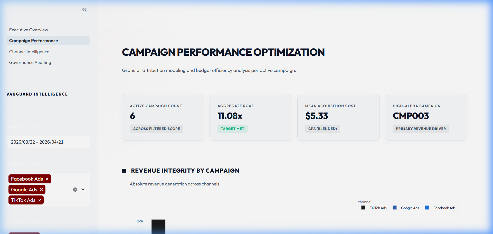
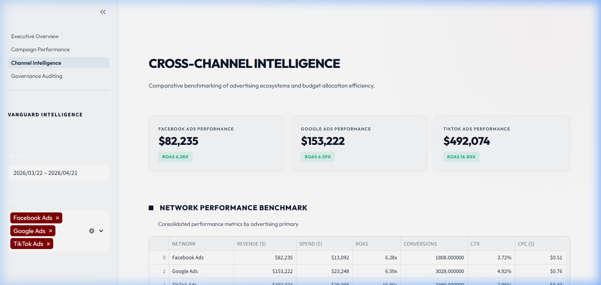
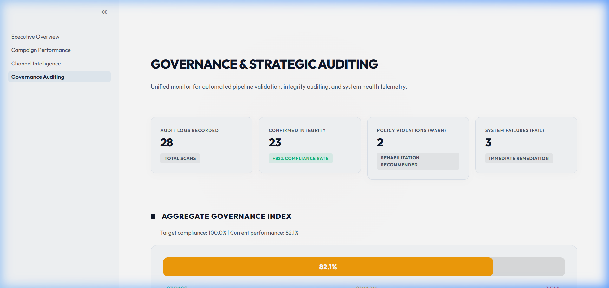

# Vanguard Marketing Intelligence Platform

Strategic multi-channel marketing data infrastructure implementing a robust Medallion Architecture (Raw to Analytics-Ready). Engineered for high-velocity ingestion of cross-platform campaign data, automated quality governance, and executive-level insight delivery.

---

## Infrastructure Architecture

The platform utilizes a modern data lakehouse pattern powered by DuckDB, Parquet, and Apache Airflow.

```
┌─────────────────┐     ┌─────────────┐     ┌─────────────┐     ┌─────────────┐
│ Upstream Source │────>│    RAW      │────>│   CLEANED   │────>│  ANALYTICS  │
│  (APIs/Events)  │     │ (Bronze)    │     │ (Silver)    │     │ (Gold)      │
│                 │     │             │     │             │     │             │
└─────────────────┘     └──────┬──────┘     └──────┬──────┘     └──────┬──────┘
                               │                    │                   │
                        ┌──────┴────────────────────┴───────────────────┘
                        │            Vanguard Data Intelligence Hub
                        └──────────────────┬─────────────────────────────┐
                                           │                             │
                                    ┌──────V──────┐              ┌───────V──────┐
                                    │  Executive  │              │  Governance  │
                                    │  Dashboard  │              │  Framework   │
                                    └─────────────┘              └──────────────┘
                                           │
                                    ┌──────V──────┐
                                    │ Orchestration │
                                    │   (Airflow)   │
                                    └─────────────┘
```

## Analytical Control Plane (Dashboard Gallery)

The platform features a premium, executive-grade dashboard built for strategic decision-making. The interface utilizes a high-contrast design system, glassmorphism aesthetics, and professional typography.


*Figure 1: Executive Overview — High-level ROI telemetry and cross-channel revenue velocity.*


*Figure 2: Campaign Intelligence — Granular performance ranking and attribution auditing.*


*Figure 3: Multi-Channel Analysis — Competitive network benchmarking and budget efficiency metrics.*


*Figure 4: Governance Monitor — Real-time integrity auditing and automated compliance reporting.*

## Strategic Objective

In fragmenting digital markets, attribution loss and data siloes represent a direct risk to ROAS. This platform provides a unified source of truth for cross-channel marketing spend and performance, processing over 1.1 million data points with automated anomaly detection and budget optimization insights.

## Quick Start Guide

### 1. Environment Setup

```bash
pip install -r requirements.txt
```

### 2. Pipeline Execution

```bash
python scripts/run_pipeline.py --mode full
```

The execution flow encompasses:
1. **Extraction**: Automated retrieval of multi-channel historical data (27-month window).
2. **Ingestion**: Raw intake into the Bronze layer with mandatory metadata tagging.
3. **Transformation**: Normalization into the Silver layer with derived KPIs (CTR, CPC, CPA, ROAS).
4. **Aggregation**: Gold layer synthesis for high-performance reporting.
5. **Validation**: Circuit-breaker quality checks (completeness, range validity, drift detection).

### 3. Executive Dashboard Launch

```bash
streamlit run dashboard/0_Executive_Overview.py
```

## Project Topology

```
vanguard-marketing-intelligence/
├── README.md                    # Strategic documentation
├── EXECUTIVE_SUMMARY.md         # Business ROI overview
├── docs/
│   └── GOVERNANCE.md            # Data quality and PII standards
├── config/
│   └── settings.py              # Enterprise configuration
├── src/
│   ├── generator/               # Vectorized traffic simulation
│   ├── pipeline/                # Medallion ETL logic
│   ├── quality/                 # Automated validation framework
│   └── utils/                   # Shared utilities (DB, logging)
├── dags/                        # Airflow orchestration
├── dashboard/                   # Premium Streamlit UI
└── warehouse/                   # SQL DDL and schema definitions
```

## Data Governance and Quality

The platform implements a defensive engineering approach to data integrity:

| Check Domain | Description | Threshold |
|--------------|-------------|-----------|
| Completeness | Checks for null campaign attribution | < 1.0% |
| Validity | Ensures spend and revenue are non-negative | Absolute |
| Consistency | Cross-table row count verification | Variable |
| Anomaly | Z-score based traffic spike detection | 3.0 Sigma |
| Freshness | Ensures data latency is under 48 hours | 48h SLA |

## Executive Insights

- **Channel Efficiency**: Real-time identification of highest ROAS channels.
- **Conversion Attribution**: Resolution of "Dark Social" and missing UTM parameters.
- **Temporal Peaks**: Identification of peak conversion windows to optimize bidding strategies.
- **Budget Reallocation**: Algorithmic recommendations for shifting spend towards high-efficiency campaigns.

## License

Internal Enterprise Portfolio - Confidential Performance Data.
