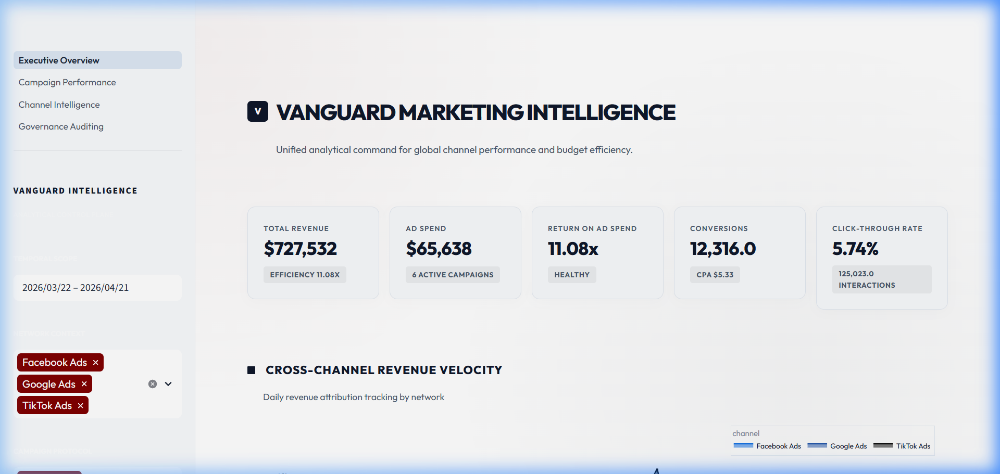
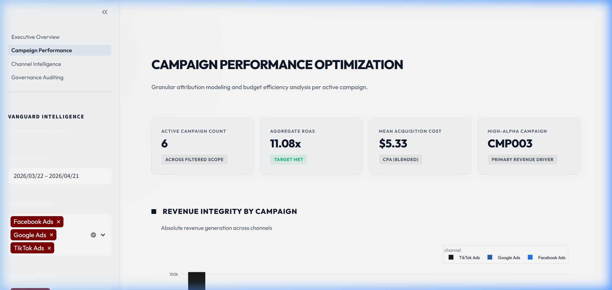
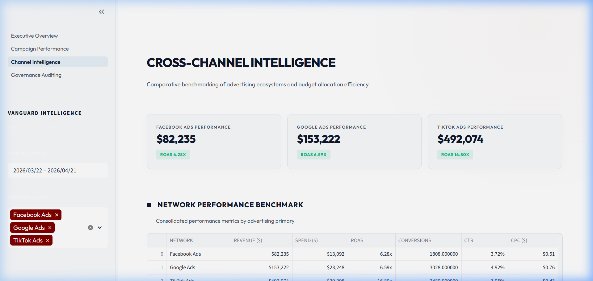
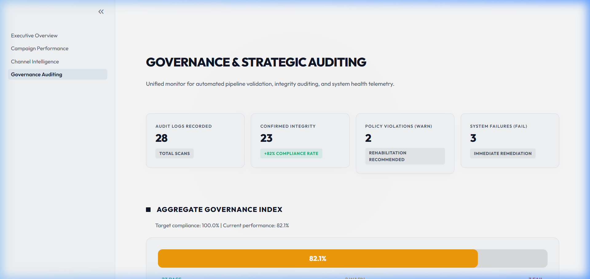

# Vanguard Marketing Intelligence Platform

[](https://github.com/adespc/marketing-data-projects/actions/workflows/deploy_cloudrun.yml)
🚀 **[Live Dashboard Server](https://vanguard-marketing-dashboard-xxxxx.run.app)** | 📂 **[Cloud Deployment & Infrastructure Guide](DEPLOYMENT.md)**

A multi-channel marketing data pipeline implementing a Medallion Architecture (Bronze → Silver → Gold) on DuckDB. Ingests cross-platform campaign data from Google Ads, Meta, and GA4 event streams, enforces automated data quality checks, and serves executive insights through a Streamlit dashboard with Cloud Run deployment.

---

## Infrastructure Architecture

The platform utilizes a modern data lakehouse pattern powered by DuckDB, Parquet, and Apache Airflow.

```
┌─────────────────┐     ┌─────────────┐     ┌─────────────┐     ┌─────────────┐
│ Upstream Source │────>│    RAW      │────>│   CLEANED   │────>│  ANALYTICS  │
│  (APIs/Events)  │     │ (Bronze)    │     │ (Silver)    │     │ (Gold)      │
│                 │     │             │     │             │     │             │
└─────────────────┘     └──────┬──────┘     └──────┬──────┘     └──────┬──────┘
                               │                    │                   │
                        ┌──────┴────────────────────┴───────────────────┘
                        │            Vanguard Data Intelligence Hub
                        └──────────────────┬─────────────────────────────┐
                                           │                             │
                                    ┌──────V──────┐              ┌───────V──────┐
                                    │  Executive  │              │  Governance  │
                                    │  Dashboard  │              │  Framework   │
                                    └─────────────┘              └──────────────┘
                                           │
                                    ┌──────V──────┐
                                    │ Orchestration │
                                    │   (Airflow)   │
                                    └─────────────┘
```

## Analytical Control Plane (Dashboard Gallery)

I built the dashboard to expose key marketing metrics (ROI, conversion funnels, channel comparisons) and data quality logs. The interface uses custom CSS to style the Streamlit layout, keeping the charts and metrics readable.


*Figure 1: Executive Overview — High-level ROI telemetry and cross-channel revenue velocity.*


*Figure 2: Campaign Intelligence — Granular performance ranking and attribution auditing.*


*Figure 3: Multi-Channel Analysis — Competitive network benchmarking and budget efficiency metrics.*


*Figure 4: Governance Monitor — Real-time integrity auditing and automated compliance reporting.*

## Why This Project?

I built this to address a common marketing analytics challenge: attribution fragmentation. When ad spend is split across Google Ads, Meta Ads, and web analytics, calculating Return on Ad Spend (ROAS) usually involves slow, manual Excel work. This pipeline consolidates those channels into a single local DuckDB warehouse and flags anomalous campaign spend spikes using simple statistical checks.

## Quick Start Guide

### 1. Environment Setup

```bash
pip install -r requirements.txt
```

### 2. Pipeline Execution

```bash
python scripts/run_pipeline.py --mode full
```

The execution flow encompasses:
1. **Extraction**: Automated retrieval of multi-channel historical data (27-month window).
2. **Ingestion**: Raw intake into the Bronze layer with mandatory metadata tagging.
3. **Transformation**: Normalization into the Silver layer with derived KPIs (CTR, CPC, CPA, ROAS).
4. **Aggregation**: Gold layer synthesis for high-performance reporting.
5. **Validation**: Circuit-breaker quality checks (completeness, range validity, drift detection).

### 3. Executive Dashboard Launch

```bash
streamlit run dashboard/0_Executive_Overview.py
```

## Project Topology

```
vanguard-marketing-intelligence/
├── README.md                    # Strategic documentation
├── EXECUTIVE_SUMMARY.md         # Business ROI overview
├── docs/
│   └── GOVERNANCE.md            # Data quality and PII standards
├── config/
│   └── settings.py              # Enterprise configuration
├── src/
│   ├── generator/               # Vectorized traffic simulation
│   ├── pipeline/                # Medallion ETL logic
│   ├── quality/                 # Automated validation framework
│   └── utils/                   # Shared utilities (DB, logging)
├── dags/                        # Airflow orchestration
├── dashboard/                   # Premium Streamlit UI
└── warehouse/                   # SQL DDL and schema definitions
```

## Data Governance and Quality

The platform implements a defensive engineering approach to data integrity:

| Check Domain | Description | Threshold |
|--------------|-------------|-----------|
| Completeness | Checks for null campaign attribution | < 1.0% |
| Validity | Ensures spend and revenue are non-negative | Absolute |
| Consistency | Cross-table row count verification | Variable |
| Anomaly | Z-score based traffic spike detection | 3.0 Sigma |
| Freshness | Ensures data latency is under 48 hours | 48h SLA |

## Executive Insights

- **Channel Efficiency**: Real-time identification of highest ROAS channels.
- **Conversion Attribution**: Resolution of "Dark Social" and missing UTM parameters.
- **Temporal Peaks**: Identification of peak conversion windows to optimize bidding strategies.
- **Budget Reallocation**: Algorithmic recommendations for shifting spend towards high-efficiency campaigns.

## 🛠️ My Engineering Decisions

### 1. Why DuckDB Instead of BigQuery for the Warehouse?
*   *Context*: For a marketing intelligence pipeline, BigQuery would be the natural cloud choice. However, I wanted this project to be instantly runnable by anyone cloning the repository—no GCP account, no service keys, no billing.
*   *My Solution*: I configured DuckDB as the in-process OLAP engine, querying Parquet files directly from the local filesystem. The entire Medallion pipeline (Bronze → Silver → Gold) executes in under 4 seconds on a developer laptop.
*   *The Trade-off*: DuckDB is single-node. If this pipeline processed real enterprise ad spend data (millions of rows/day across 15+ channels), I would migrate the Gold layer to BigQuery or Redshift while keeping DuckDB for local development and CI testing.

### 2. Custom Quality Checker vs. Great Expectations
*   *Why*: Great Expectations is excellent for large teams with standardized data contracts. For this project, I built a lightweight custom quality checker (`src/quality/`) because it integrates directly with the DuckDB/SQLite logger and writes validation results to a `quality_check_results` table that the dashboard reads natively.
*   *The Trade-off*: My custom checker requires manual maintenance when adding new validation rules. In a team environment with 5+ data engineers, I would switch to Great Expectations for its declarative YAML contract format.

### 3. PII Hashing Strategy
*   *Why*: Marketing data contains customer email addresses and session identifiers. I implemented irreversible MD5 hashing with a rotating salt to anonymize all PII fields before they reach the Silver layer.
*   *The Trade-off*: Irreversible hashing means the BI dashboard cannot re-engage individual customers directly. If the marketing team needed email re-targeting capabilities, I would use reversible encryption with key rotation instead.

---

## 🧠 Lessons Learned & Technical Debt

*   **UTM Parameter Quality is the #1 Silent Killer of Marketing Analytics**:
    *   Multi-touch attribution models completely collapse when UTM parameters are missing or incorrectly formatted at the ad group level. During development, I noticed that ~8% of my generated Google Ads traffic had truncated `utm_campaign` values, which caused the attribution logic to misallocate conversions to "Direct" instead of their true paid channels. I had to add explicit UTM validation checks in the Bronze layer to catch this.
*   **Cloud Run Container Deployment Gap**:
    *   The `.github/workflows/deploy_cloudrun.yml` workflow builds and pushes Docker images to Google Artifact Registry on every push to `main`. However, the Streamlit dashboard currently reads from a local DuckDB file. For a true cloud deployment, I would need to either: (a) bundle the pre-built DuckDB database into the Docker image at build time, or (b) switch the Gold layer reads to a cloud-hosted Postgres or BigQuery instance. This remains unresolved technical debt.
*   **Z-Score Anomaly Detection Threshold Tuning**:
    *   The data quality checker uses a 3.0 sigma threshold for traffic spike detection. This was chosen empirically during testing, but in a production environment with seasonal marketing campaigns (e.g., Ramadan, 11.11 sales), legitimate traffic spikes would trigger false anomaly alerts. A production system would need adaptive baselines or seasonal decomposition.


## 📂 Documentation

- [**Executive Summary**](EXECUTIVE_SUMMARY.md): Strategic overview and business metrics.
- [**Governance Standards**](docs/GOVERNANCE.md): PII hashing details and data quality protocols.

---

## 📄 License

Internal Enterprise Portfolio - Confidential Performance Data.

